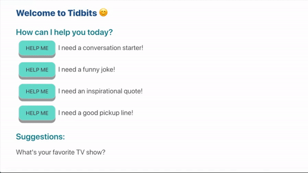

# Tidbits
> A full stack app that gives suggestions for either conversation starters, jokes, inspirational quotes or pick-up lines



## Stack

React.js, Express, MongoDB, Webpack

## How To Use
```
# clone this repository
$ git clone https://github.com/sowmyaneni/Tidbits.git

# install dependencies
$ npm install

# compile/transpile files with webpack
$ npm run react-dev
$ npm run start
```

## Requirements
* [npm](https://www.npmjs.com/)
* [Node.js](https://nodejs.org/en/download/)
* [Git](https://git-scm.com/)


